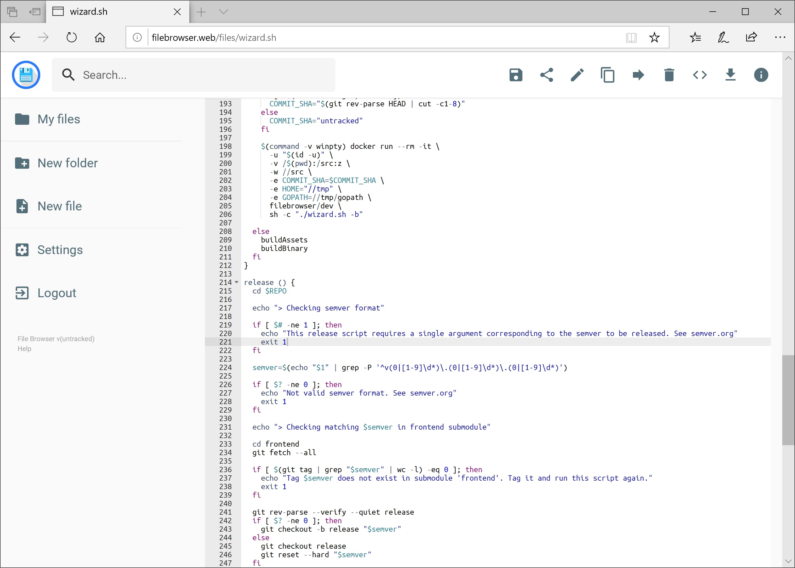

#
<h2>Fork Information</h2>

This fork adds <strong>video thumbnail generation</strong> to FileBrowser.

Inspired by <a href="https://github.com/cody82/filebrowser/tree/videopreview">this fork</a> by cody82, but further customized.

<h3>Customizations include:</h3>
<ul>
  <li>Thumbnails are stored in a <code>.thumbnails</code> subfolder, alongside the existing cache mechanism.</li>
  <li><strong>Hardware acceleration</strong> is dynamically selected based on the OS for maximum compatibility:
    <ul>
      <li><strong>Linux</strong>: VA-API</li>
      <li><strong>Windows</strong>: DXVA2</li>
      <li><strong>Mac</strong>: VideoToolbox</li>
    </ul>
  </li>
  <li>Thumbnail generation <strong>pauses when leaving a folder</strong>, allowing new folders to start processing without waiting for previous ones to finish.</li>
</ul>

<h3>Requirements</h3>
<ul>
  <li><strong>FFmpeg</strong> is required.</li>
  <li>The <strong>ctx utility</strong> is used to handle stopping thumbnail generation.</li>
</ul>

<h3>Notes</h3>
<ul>
  <li><strong>22-Feb-25</strong> – This fork will now be <strong>automatically kept up to date</strong> via GitHub Actions.</li>
  <li>The following files were modified:
    <ul>
      <li><code>/http/preview.go</code></li>
      <li><code>/frontend/src/components/files/ListingItem.vue</code></li>
    </ul>
  </li>
</ul>

<h3>About This Project</h3>

ChatGPT was heavily involved in generating the code.

Although I have programming experience and even a <strong>software engineering degree</strong>, my career path led me to <strong>IT and System Administration</strong>.

This is my <strong>first real experience with Golang</strong>, so go easy on me! 😅

  

filebrowser provides a file managing interface within a specified directory and it can be used to upload, delete, preview, rename and edit your files. It allows the creation of multiple users and each user can have its own directory. It can be used as a standalone app.

> [!WARNING]
>
> This project is currently on **maintenance-only** mode, and is looking for new maintainers. For more information, please read the [discussion #4906](https://github.com/filebrowser/filebrowser/discussions/4906). Therefore, please note the following:
>
> - It can take a while until someone gets back to you. Please be patient.
> - [Issues][issues] are only being used to track bugs. Any unrelated issues will be converted into a [discussion][discussions].
> - No new features will be implemented until further notice. The priority is on triaging issues and merge bug fixes.
> 
> If you're interested in maintaining this project, please reach out via the discussion above.

[issues]: https://github.com/filebrowser/filebrowser/issues
[discussions]: https://github.com/filebrowser/filebrowser/discussions

## Features

File Browser is a **create-your-own-cloud-kind** of software where you can install it on a server, direct it to a path and then access your files through a nice web interface. You have many available features!

|    Easy Login System     |     Sleek Interface      |     User Management      |
| :----------------------: | :----------------------: | :----------------------: |
|  |  |  |

|       File Editing       |     Custom Commands      |      Customization       |
| :----------------------: | :----------------------: | :----------------------: |
|  |  |  |

## Install

For information on how to install File Browser, please check [installation](docs/installation.md).

## Configuration

For information on how to configure File Browser, please check [configuration](docs/configuration.md).

## Contributing

For information on how to contribute to the project, including how translations are managed, please check [contributing](docs/contributing.md).
